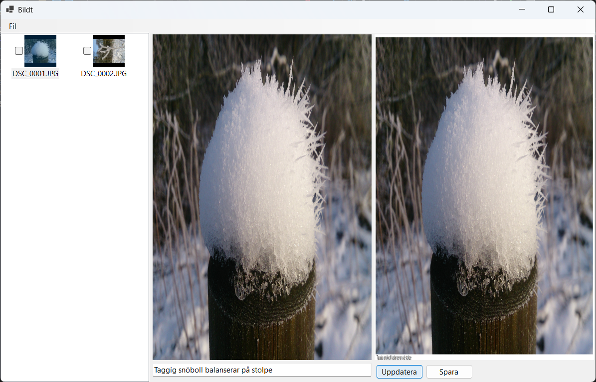

# Bildt - Program för att bränna in text i bildfiler

Detta är ett program som låter dig bränna in text i bildfiler, vilket kan vara användbart för att skapa bilder med text som kan användas i presentationer.

## Versioner

- 1.0.1: Förbättrad hantering av bildstorlek och textplacering.
- 1.0.0: Första versionen av Bildt.